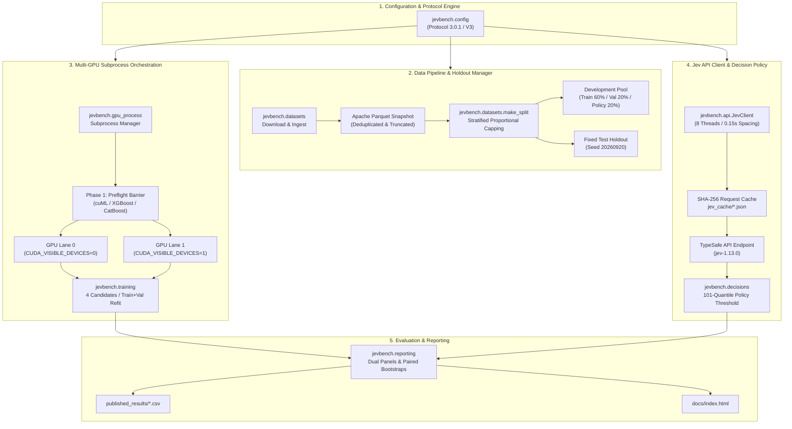
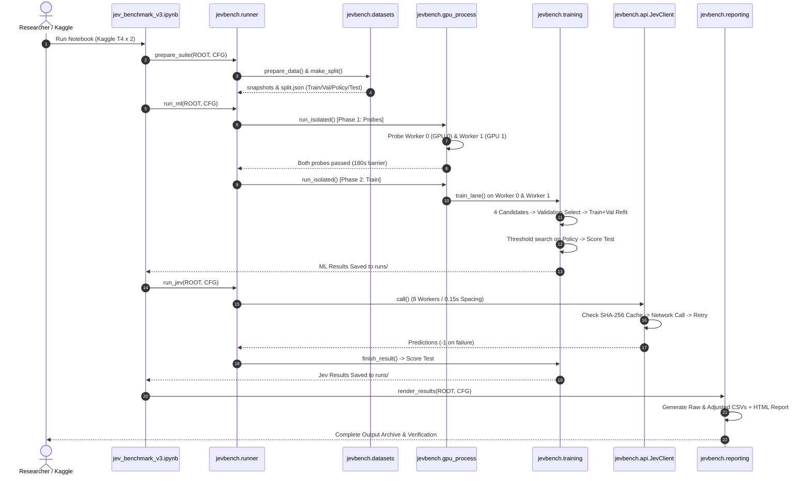

# System Architecture & Codebase Map

This document provides a comprehensive technical reference for the software architecture, module layout, dataflow, hardware isolation boundaries, and storage schemas of the **Jev-vs-ML** benchmark (Protocol 3.0.1 / V3).

---

## 1. High-Level System Architecture

The benchmark consists of four decoupled subsystems orchestrated through a unified configuration engine:



---

## 2. Layered Software Architecture

The benchmark architecture is structured into four distinct layers, cleanly decoupling scientific definitions, pipeline components, execution infrastructure, and publication artifacts:

```text
┌────────────────────────────────────────────────────────────────────────┐
│ Layer 1: Experiment Definition & Configuration                         │
│ benchmark.config (Protocol 3.0.1 presets, sample caps, seed protocols) │
└───────────────────────────────────┬────────────────────────────────────┘
                                    │
                                    ▼
┌────────────────────────────────────────────────────────────────────────┐
│ Layer 2: Scientific Pipeline                                           │
│ ┌──────────────────────┐   ┌──────────────────────┐                    │
│ │ benchmark.data       │──▶│ benchmark.features   │                    │
│ │ Ingestion & Splitting│   │ Feature Extractors   │                    │
│ └──────────────────────┘   └──────────┬───────────┘                    │
│                                       │                                │
│                   ┌───────────────────┴───────────────────┐            │
│                   ▼                                       ▼            │
│        ┌──────────────────────┐               ┌──────────────────────┐ │
│        │ benchmark.models     │               │ benchmark.jev        │ │
│        │ Registry & Training  │               │ Prompts, API, Cache  │ │
│        └──────────┬───────────┘               └──────────┬───────────┘ │
│                   │                                       │            │
│                   └───────────────────┬───────────────────┘            │
│                                       ▼                                │
│                            ┌──────────────────────┐                    │
│                            │ benchmark.evaluation │                    │
│                            │ Policies & Bootstrap │                    │
│                            └──────────────────────┘                    │
└───────────────────────────────────┬────────────────────────────────────┘
                                    │
                                    ▼
┌────────────────────────────────────────────────────────────────────────┐
│ Layer 3: Execution Infrastructure                                      │
│ benchmark.execution (runner orchestrator, subprocess GPU isolation)   │
└───────────────────────────────────┬────────────────────────────────────┘
                                    │
                                    ▼
┌────────────────────────────────────────────────────────────────────────┐
│ Layer 4: Publication & Reporting                                       │
│ benchmark.reporting (CSV generation, matrix tables, HTML report)       │
└────────────────────────────────────────────────────────────────────────┘
```

---

## 3. Complete Repository Map

```text
Jev-vs-ML/
│
├── README.md                          # Primary research overview, headline results & guide
├── ARCHITECTURE.md                    # System architecture & codebase reference (this document)
├── CONTRIBUTING.md                    # Contributor guide, workflow tree & review checklist
├── BENCHMARK_AUDIT.md                 # 16-section technical audit & verification sign-off
├── BENCHMARK_V3.md                    # Protocol 3.0.1 (V3) specification & fast budget overrides
├── BENCHMARK_V2.md                    # Common Protocol 2.0.0 baseline specification
├── VALIDATION_V3.md                   # V3 execution & verification records
├── VALIDATION_V2.md                   # V2 historical validation records
├── LICENSE                            # MIT License
├── requirements-dev.txt               # Development dependencies
│
├── benchmark/                         # Modular research package (Modern Architecture)
│   ├── __init__.py                    # Top-level exports & version identifier (3.0.1)
│   ├── config.py                      # Centralized configuration & protocol budgets
│   ├── data/                          # Data subsystem
│   │   ├── __init__.py                # Subsystem exports
│   │   ├── datasets.py                # Ingestion, Parquet snapshots & specs
│   │   ├── splits.py                  # Stratified holdout & development splits
│   │   └── sampling.py                # Proportional capping algorithms
│   ├── features/                      # Feature extraction subsystem
│   │   ├── __init__.py                # Subsystem exports
│   │   └── transformers.py            # Estimator-appropriate text & tabular transformers
│   ├── models/                        # Classical ML subsystem
│   │   ├── __init__.py                # Subsystem exports
│   │   ├── registry.py                # Predeclared candidate grids (11 model families)
│   │   ├── backends.py                # Hardware routing (cuML GPU vs. scikit-learn CPU)
│   │   └── training.py                # Candidate fitting, validation selection & refit
│   ├── jev/                           # Jev semantic classification subsystem
│   │   ├── __init__.py                # Subsystem exports
│   │   ├── client.py                  # TypeSafe API client (rate limits & retries)
│   │   ├── prompts.py                 # Zero-shot / few-shot prompt serialization
│   │   └── cache.py                   # Deterministic SHA-256 request hashing & cache
│   ├── evaluation/                    # Scientific evaluation subsystem
│   │   ├── __init__.py                # Subsystem exports
│   │   ├── decisions.py               # Post-hoc policy threshold calibration
│   │   ├── metrics.py                 # Accuracy, macro-F1, Brier, and ECE
│   │   └── bootstrap.py               # Paired bootstrap confidence intervals
│   ├── execution/                     # Infrastructure subsystem
│   │   ├── __init__.py                # Subsystem exports
│   │   ├── runner.py                  # Pipeline coordinator (prep, ML, Jev)
│   │   └── gpu.py                     # Subprocess CUDA isolation & preflight barrier
│   └── reporting/                     # Publication reporting subsystem
│       ├── __init__.py                # Subsystem exports
│       └── reporting.py               # CSV matrix aggregation & HTML report generator
│
├── jevbench/                          # Historical benchmark package (Exact Protocol 3.0.1 runtime)
│   └── ...                            # Preserved byte-for-byte for artifact reproducibility
│
├── published_results/                 # Canonical benchmark artifacts extracted from notebook
│   ├── manifest.json                  # Cryptographic SHA-256 provenance manifest
│   ├── raw_balanced_accuracy.csv      # Extracted raw balanced accuracy CSV
│   └── adjusted_balanced_accuracy.csv # Extracted policy-adjusted balanced accuracy CSV
│
├── docs/                              # Interactive GitHub Pages report & deep-dive guides
│   ├── index.html                     # Responsive interactive benchmark report
│   ├── methodology.md                 # Deep-dive: data flow, capping & calibration math
│   ├── gpu-architecture.md            # Deep-dive: GPU subprocess isolation & probe barrier
│   ├── api.md                         # Deep-dive: TypeSafe API client, concurrency & caching
│   ├── reproducibility.md             # Deep-dive: Kaggle execution & local verification
│   └── limitations.md                 # Deep-dive: scientific caveats & boundary conditions
│
├── validate_all.py                    # Unified contributor verification suite (5/5 offline checks)
├── validate_benchmark_package.py      # Import & contract verification for benchmark.*
├── validate_v3_artifact.py            # Offline validation of notebook hashes, bundle & CSVs
├── validate_v3_backends.py            # Offline validation of cuML constructor routing doubles
├── validate_gpu_process.py            # Offline validation of subprocess GPU device masking
├── validate_sampling.py               # Proportional capping edge-case regression tests
├── validate_tabular_v2.py             # Diagnostic validation of tabular pipelines
├── validate_parallel.py               # Parallel job orchestration sanity checks
├── validate_v2.py                     # Comprehensive end-to-end CPU mock integration test
├── validate_notebook.py               # Notebook cell compilation and structure validator
│
├── requirements-v2.txt                # Benchmark runtime dependencies (pinned versions)
├── requirements-dev.txt               # Development & validation dependencies
├── .gitignore                         # Excludes virtual environments, .env, and generated/
└── .gitattributes                     # Line-ending normalizations
```

---

## 3. Detailed Component Architecture (`jevbench/`)

### 3.1 Configuration Engine (`jevbench/config.py`)
Centralizes all experiment hyperparameters to prevent hidden score-driven per-dataset tuning:
* **`preset='v3'` (Protocol 3.0.1):**
  * `train_cap=8000`, `validation_cap=1000`, `policy_cap=500`, `test_cap=1000` (`banking_test_cap=1500`).
  * `trees=150`, `histogram_iterations=60`, `early_stopping=15`.
  * `word_features=20000`, `char_features=10000`, `selected_features=512`, `svd_components=32`.
  * `jev_workers=8`, `min_request_interval=0.15`, `max_api_attempts=65000`, `max_estimated_api_usd=20.0`.
  * `seeds=[2027, 2028, 2029]`, `holdout_seed=20260920`.

### 3.2 Data Ingestion & Splitting (`jevbench/datasets.py`)
1. **`download(url, root)` / `hf_frames(repo, root)`:** Fetches public datasets and caches them locally by URL SHA-256. Pins HuggingFace dataset commit hashes to ensure snapshot stability.
2. **`dataset_spec(name, root)`:** Returns raw dataframes, modality type (`'text'` or `'tabular'`), class label list, semantic task instructions, and dataset source provenance.
3. **`prepare_data(name, root, cfg)`:**
   * Truncates text to `max_text_chars = 4,000`.
   * Identifies identical input rows; completely drops input rows with conflicting target labels.
   * Gives official test partition precedence when duplicates span splits.
   * Saves frozen `snapshot.parquet` and `metadata.json` with cryptographic SHA-256 verification.
4. **`cap_indices(ids, y, cap, seed)`:** Custom integer quota optimizer allocating at least 1 sample per class, balancing class deficits and excesses proportional to class prevalence.
5. **`make_holdout(df, cfg)`:** Generates an immutable holdout test set using `holdout_seed = 20260920`, excluding any indices that overlap with exploratory pilot test sets (`exclude_pilot_tests=True`).
6. **`make_split(df, holdout, cfg, seed)`:** Divides the remaining development pool 60/20/20 into `train`, `validation`, and `policy` partitions for each training seed.

### 3.3 Feature Extraction Pipelines (`jevbench/features.py`)
Encapsulates feature transformers inside the `Features` class, fit strictly on training partitions:
* **Text Mode:**
  * Linear: `TfidfVectorizer` (Word 1–2 n-grams) $\oplus$ `TfidfVectorizer` (Char 3–5 n-grams) $\rightarrow$ CSR matrix.
  * Tree: Word TF-IDF $\rightarrow$ `SelectKBest(chi2, k=512)` $\rightarrow$ sparse CSR (`tree`) / dense array (`dense`).
  * k-NN / HistGradientBoosting: Word TF-IDF $\rightarrow$ `TruncatedSVD(n_components=32)` $\rightarrow$ `StandardScaler`.
* **Tabular Mode:**
  * Dense: `ColumnTransformer` with median imputation + standard scaling for numeric features, and most-frequent imputation + one-hot encoding for categoricals.
  * Native Categorical (`'cat'`): Replaces missing numeric values with medians and categoricals with `'__MISSING__'` for CatBoost.

### 3.4 Hardware & Subprocess Isolation (`jevbench/gpu_process.py`)
Guarantees clean CUDA device isolation by executing all GPU code in fresh subprocesses:
* **`visible_devices()`:** Queries available NVIDIA GPU UUIDs via `nvidia-smi`.
* **`child_environment(device, threads)`:** Generates a sanitized environment with `CUDA_VISIBLE_DEVICES=<device>`, `PYTHONUNBUFFERED=1`, and thread pool ceilings (`OMP_NUM_THREADS=2`).
* **`run_phase(root, cfg, devices, lanes, phase)`:**
  1. Spawns child interpreters via `subprocess.Popen([sys.executable, '-u', '-m', 'jevbench.gpu_process', ...])`.
  2. Streams worker log outputs in real-time.
  3. Enforces a 180-second timeout on the probe phase.
  4. Automatically terminates and reaps child processes via `finally` blocks upon interruption.
* **`run_isolated(root, cfg, gpu_ids)`:** Manages the two-phase barrier (Phase 1: Preflight Probes $\rightarrow$ Phase 2: Sequential Training Lanes).

### 3.5 Model Routing & Estimators (`jevbench/backends.py` & `jevbench/models.py`)
1. **`candidates(name, cfg, text, seed, gpu_id)`:** Generates the 4 candidate configurations for each of the 11 model families (2 hyperparameter settings $\times$ ordinary/balanced sample weights).
2. **`route(name, rep, model, weighted, text, classes, cfg, gpu_id)`:**
   * Explicitly replaces scikit-learn models with cuML GPU equivalents (Logistic Regression, unweighted Random Forest, k-NN, binary tabular RBF SVM).
   * Preserves scikit-learn CPU execution for weighted Random Forests, LinearSVC on sparse text, and multiclass tabular SVM.
   * Configures native CUDA acceleration for XGBoost and CatBoost.
3. **`fit_candidate(...)`:** Fits estimators, passes balanced sample weights, enables early stopping on validation subsets, and captures fitted boosting iterations.

### 3.6 Decision Policy & Threshold Calibration (`jevbench/decisions.py`)
1. **`outputs(model, x, n_classes)`:** Extracts raw class predictions, continuous decision margins (`decision_function`), or predicted probabilities (`predict_proba`).
2. **`choose_threshold(y_policy, scores, default, quantiles=101)`:**
   * Generates a 101-point quantile grid across continuous scores on the independent `policy` split.
   * Identifies the threshold maximizing balanced accuracy, breaking ties toward the default threshold.
3. **`score_result(y, pred, n_classes, scores, probabilities)`:**
   * Computes accuracy, balanced accuracy, macro-F1, per-class recall, and full confusion matrix.
   * Failed API calls (`prediction = -1`) are included and penalized as incorrect.
   * Computes ROC-AUC, Average Precision, Brier score, clipped log-loss, and 10-bin Expected Calibration Error (ECE).

### 3.7 Jev API Client (`jevbench/api.py`)
1. **`JevClient`:**
   * Authenticates using Kaggle Secrets or `TYPESAFE_API_KEY`.
   * Enforces a minimum request spacing of `0.15s` via a centralized `threading.Lock`.
   * Manages thread-local `requests.Session()` connections across 8 worker threads.
2. **Token Heuristic & Budget Guards:**
   * Estimates request cost based on JSON UTF-8 byte length at $\$0.042$ per million input tokens.
   * Enforces hard execution ceilings (max 65,000 attempts / max $\$20.00$ estimated spend).
3. **Deterministic Cache:**
   * Canonical JSON serialization $\rightarrow$ SHA-256 hash (`request_hash`).
   * Saves responses to `jev_cache/<request_hash>.json`. Reuses identical zero-shot queries across seeds instantly.
4. **Retry & Error Mechanics:**
   * Retries transient HTTP errors (`408`, `429`, `500`, `502`, `503`, `504`) up to 2 times with exponential backoff.
   * Immediately halts execution on permanent HTTP client errors (`401`, `403`, `400`).
   * Encodes exhausted failures as `prediction = -1`.

### 3.8 Runner & Orchestration (`jevbench/runner.py`)
* **`prepare_suite(root, cfg, pilot_root)`:** Builds filesystem run hierarchy, writes `manifest.json`, downloads/snapshots all datasets, generates holdout splits, and logs dataset summaries.
* **`run_ml(root, cfg, gpu_ids)`:** Dispatches isolated GPU training workers across lanes.
* **`run_jev(root, cfg, client)`:** Iterates through dataset/seed/mode combinations, sampling few-shot examples from `train`, requesting `policy` (binary) and `test` partitions, and saving results.

### 3.9 Reporting & Bootstrap Analysis (`jevbench/reporting.py`)
* **`read_results(root, cfg)`:** Aggregates individual model JSON result files from `runs/<dataset>/<seed>/<model>.json`.
* **`paired_intervals(results, cfg)`:** Computes stratified test-case bootstrap differences (1,000 resamples) paired across models and seeds.
* **`render_results(root, cfg)`:** Produces summary CSV matrices (`raw_balanced_accuracy.csv`, `adjusted_balanced_accuracy.csv`, `scores_by_seed.csv`, `run_diagnostics.csv`) and compiles a standalone HTML report.

---

## 4. End-to-End Execution Sequence



---

## 5. Storage Hierarchy & Schemas

### 5.1 Run Output Directory Structure
```text
/kaggle/working/jev_benchmark_v3_1/
├── manifest.json                     # Code hashes, package versions & configuration
├── cuml_probes.json                  # Preflight GPU probe outputs
├── dataset_overview.csv              # Row counts, class distributions & split sizes
├── raw_balanced_accuracy.csv         # Canonical raw results table
├── adjusted_balanced_accuracy.csv    # Canonical policy-adjusted results table
├── scores_by_seed.csv                # Per-seed metrics (accuracy, F1, AUC, Brier, ECE)
├── run_diagnostics.csv               # Backend selections, trial failures & model IDs
├── paired_bootstrap_intervals.csv   # 95% bootstrap difference intervals
├── report.html                       # Self-contained HTML report
│
├── data/                             # Dataset snapshots
│   └── <dataset_slug>/
│       ├── snapshot.parquet          # Deduplicated dataset
│       ├── metadata.json             # Modality, feature names, sha256
│       └── holdout.json              # Fixed test & excluded pilot indices
│
├── runs/                             # Execution logs per dataset/seed
│   └── <dataset_slug>/<seed>/
│       ├── split.json                # Train, validation, policy, test indices
│       ├── <model_name>.trials.json  # Candidate trial metrics, times, warnings
│       ├── <model_name>.json         # Final refit results, predictions, metrics
│       └── Jev <mode>.responses.json # Full API response payloads & timing
│
├── jev_cache/                        # Persistent request cache
│   └── <request_hash>.json           # Exact response payload keyed by SHA-256
│
└── gpu_workers/<worker_uuid>/        # Real-time worker subprocess logs
    ├── probe_0.log / probe_1.log
    └── train_0.log / train_1.log
```

### 5.2 Manifest Schema (`manifest.json`)
```json
{
  "source_notebook": "jev_benchmark_v3.ipynb",
  "sha256": "9835ceb7b1db2f0ffd1b93e713c998ccc7ad3a38feb5fa33488118fb4e197367",
  "protocol": "3.0.1",
  "requested_jev_model": "jev-1.13.0",
  "training_seeds": [2027, 2028, 2029],
  "holdout_seed": 20260920,
  "provenance": "Final saved notebook outputs; no cells rerun. CSV values retain displayed rounding.",
  "uncertainty": "Mean and sample SD across training seeds on the same test cases; not confidence intervals.",
  "unavailable": [
    "per-example predictions",
    "paired_bootstrap_intervals.csv",
    "run_diagnostics.csv",
    "dataset snapshots",
    "full Kaggle result archive"
  ]
}
```

---

## 6. Execution Modes: Kaggle vs. Local Offline Verification

| Feature / Subsystem | Kaggle Production Mode | Local CPU Offline Verification Mode |
|---|---|---|
| **Entry Point** | `jev_benchmark_v3.ipynb` | `validate_v3_artifact.py`, `validate_gpu_process.py`, etc. |
| **Hardware** | Two NVIDIA Tesla T4 GPUs | Standard x86_64 CPU (Windows / Linux / macOS) |
| **Subprocess Isolation** | Active (`gpu_process.py` sets `CUDA_VISIBLE_DEVICES`) | Mock subprocess tests (`test-environment` phase) |
| **Accelerated Estimators** | cuML GPU & native CUDA XGBoost/CatBoost | Constructor doubles & scikit-learn CPU estimators |
| **API Calls** | Live authenticated calls to TypeSafe API | Mock responses / disk cache validation |
| **Verification Scope** | Full benchmark computation & result generation | Code syntax, digest hashing, routing contracts & stratification |
